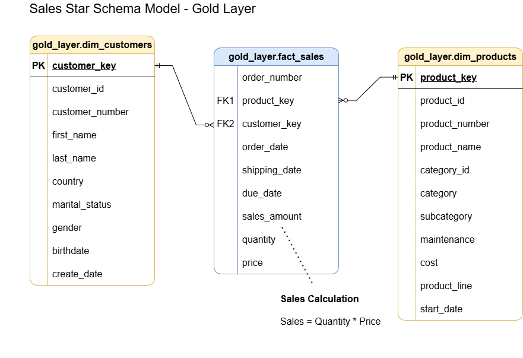

# SQL Exploratory Data Analysis Project

Welcome to the **SQL Exploratory Data Analysis Project** repository! 🚀  

This project showcases structured **exploratory data analysis (EDA) using SQL** on a sales dataset, focusing on understanding data distributions, key business metrics, and performance rankings.  
It is designed as a **portfolio project** to demonstrate practical SQL analytics skills.

---

## 📖 Project Overview

This project involves:

1. **Database Exploration** – Understanding tables, columns, and schema structure.
2. **Dimension Analysis** – Exploring customer and product attributes.
3. **Date Analysis** – Identifying data boundaries and customer age distribution.
4. **Measure Analysis** – Calculating key business metrics.
5. **Magnitude Analysis** – Comparing metrics across dimensions.
6. **Ranking Analysis** – Identifying top and bottom performers.

---

## 🏛️ Data Model

The analysis is built on a **star schema** consisting of:

- **dim_customers** – Customer demographics and attributes  
- **dim_products** – Product and category details  
- **fact_sales** – Transaction-level sales data  

- 

---

## 📂 Repository Structure

- **datasets**
  - [dim_customers.csv](datasets/dim_customers.csv)
  - [dim_products.csv](datasets/dim_products.csv)
  - [fact_sales.csv](datasets/fact_sales.csv)

- **scripts**
  - [database_exploration.sql](scripts/database_exploration.sql)
  - [dimension_exploration.sql](scripts/dimension_exploration.sql)
  - [date_exploration.sql](scripts/date_exploration.sql)
  - [measure_exploration.sql](scripts/measure_exploration.sql)
  - [magnitude_analysis.sql](scripts/magnitude_analysis.sql)
  - [ranking_analysis.sql](scripts/ranking_analysis.sql)

- **docs**
  - 

- [README.md](README.md)

---

## 🔍 Analysis Focus

- Understanding database structure and schema
- Exploring dimensions and categorical distributions
- Identifying data time span and customer age boundaries
- Computing core business KPIs
- Comparing metrics across categories and regions
- Ranking products and customers by performance

---

## 🛠️ Technologies Used

- **MySQL**
- **SQL** (aggregations, joins, window functions)
- **Git & GitHub**
- **VS Code**
- **CSV datasets**

---

## 🎯 Purpose of the Project

This project was created to:

- Strengthen SQL exploratory analysis skills  
- Practice analytical thinking using real-world datasets  
- Build a clean, recruiter-friendly SQL portfolio project  

---

## 🛡️ License

This project is licensed under the **MIT License**.  
You are free to use, modify, and share this project with proper attribution.

---

## ⭐ About Me

Hi, I’m **Syed Naveen Nikkath**, an aspiring Data Analyst with hands-on experience in SQL, Excel, Power BI, and Python fundamentals. I enjoy analyzing data and translating it into meaningful business insights.
